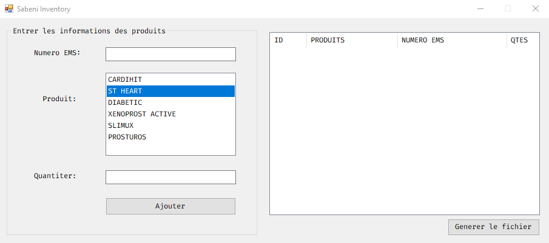

# 🗃️ Sabeni Inventory

**Sabeni Inventory** is a lightweight Windows Forms application developed to automate the management of EMS product returns within the **Sabeni Interconnections** company.

## 📷 Overview

 <!-- si tu ajoutes une capture d'écran du logiciel -->

## 🛠️ Technologies Used

- [C#/.NET 8](https://dotnet.microsoft.com/)
- WinForms (Windows Forms)
- [ClosedXML](https://github.com/ClosedXML/ClosedXML) – for generating Excel files
